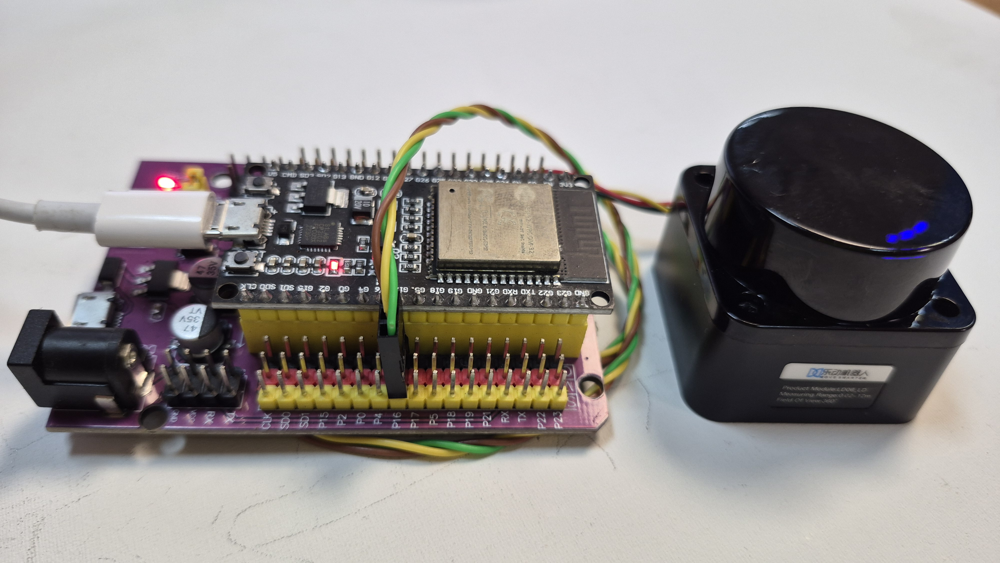
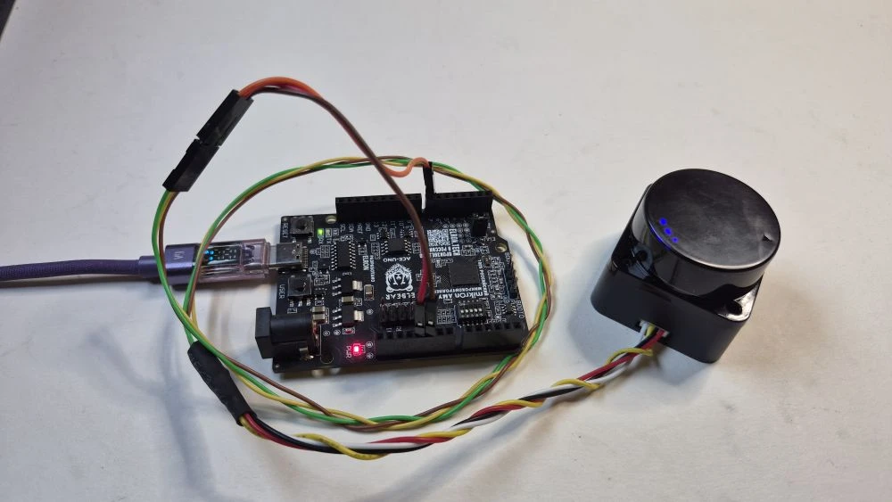
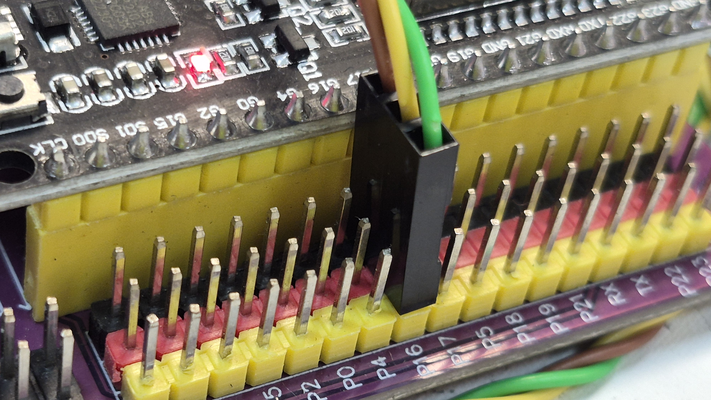
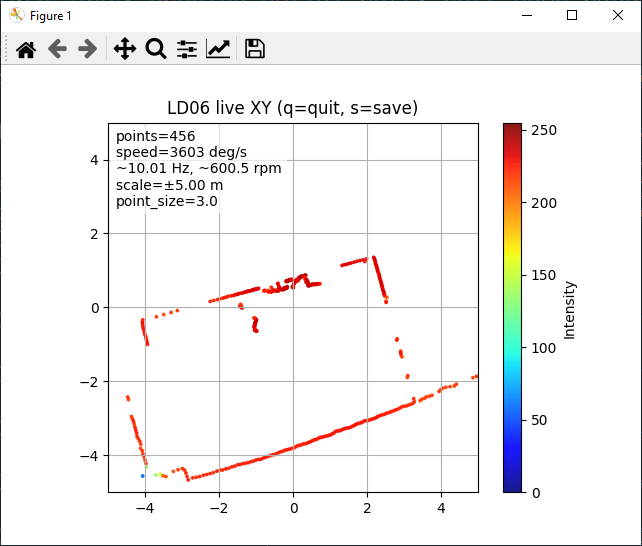
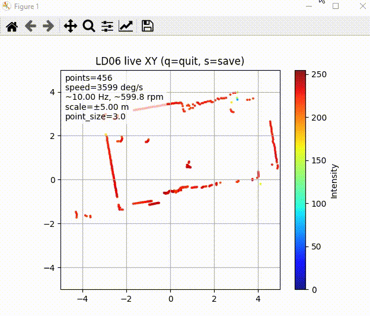

# LD06 LiDAR + ESP32 + Python

> Чтение лидара **LD06**, проверки пакетов на **ESP32** и визуализации в **Python**.

```text
LD06 → ESP32 → USB Serial → Python → live XY-график / фильтрация
```

Проект разделён на две части:

- **ESP32-скетч** принимает поток UART от LD06, находит границы пакетов, проверяет CRC и пересылает в USB только корректные пакеты.
- **Python-программа** повторно декодирует поток, восстанавливает углы точек, собирает полный оборот и рисует облако точек в окне `matplotlib`.

Такую архитектуру удобно использовать как для отладки, так и как основу для более серьёзных задач:

- навигация мобильного робота;
- объезд препятствий;
- подготовка к интеграции с ROS2;
- запись логов и последующее воспроизведение;


---

## Демонстрация


### 1) Фото




### 2) Подключение LD06 к ESP32



### 3) Окно визуализации



### 4) GIF-демо




## Аппаратная схема

Минимальное подключение:

- **TX LD06** → **RX (16 pin) ESP32**
- **GND LD06** → **GND ESP32**
- **питание LD06** → **5V ESP32**

---

## Быстрый старт

### 1. Прошить ESP32


```text
esp32/esp32.ino
```

### 2. Установить Python-зависимости

```bash
pip install -r requirements.txt
```

### 3. Настроить COM-порт

В файле:

```text
python/ld06_live_viewer.py
```

изменить строку:

```python
PORT = "COM3"
```

на свой порт:

- Windows: `COM4`, `COM7`
- Linux: `/dev/ttyUSB0`
- macOS: `/dev/tty.usbserial-...`

### 4. Запустить визуализацию

```bash
python python/ld06_live_viewer.py
```

Если всё подключено правильно, откроется окно с live-графиком точек.

---

## Клавиши управления в Python-окне

- `q` — закрыть окно
- `s` — сохранить скриншот текущего кадра

---

## Протокол LD06 — подробный разбор

LD06 передаёт не картинку и не координаты `x/y`, а поток бинарных пакетов. Каждый пакет содержит небольшой сектор скана.

### Общая структура пакета

```text
| Byte | Поле         | Размер | Назначение                          |
|------|--------------|--------|-------------------------------------|
| 0    | HEADER       | 1      | 0x54 — начало пакета                |
| 1    | VER_LEN      | 1      | версия + количество точек           |
| 2-3  | SPEED        | 2      | скорость вращения, deg/s            |
| 4-5  | START_ANGLE  | 2      | начальный угол сектора              |
| 6... | POINTS       | 3*N    | точки: distance + intensity         |
| ...  | END_ANGLE    | 2      | конечный угол сектора               |
| ...  | TIMESTAMP    | 2      | временная метка                     |
| last | CRC          | 1      | контрольная сумма                   |
```

### Формула длины пакета

Если в пакете `N` точек:

```text
packet_len = 11 + 3 * N
```

Почему так:

```text
1 HEADER
1 VER_LEN
2 SPEED
2 START_ANGLE
3*N POINTS
2 END_ANGLE
2 TIMESTAMP
1 CRC
```

---

## Поле VER_LEN

Второй байт пакета совмещает два значения:

```text
VER_LEN = [VVVNNNNN]
```

- `VVV` — версия
- `NNNNN` — число точек в пакете

Разбор в коде:

### Arduino

```cpp
uint8_t ver_len = packet[1];
uint8_t ver = (ver_len >> 5) & 0x07;
uint8_t n = ver_len & 0x1F;
```

### Python

```python
ver_len = packet[1]
ver = (ver_len >> 5) & 0x07
n_points = ver_len & 0x1F
```

---

## Формат одной точки

Каждая точка занимает 3 байта:

```text
| 2 байта | distance_mm |
| 1 байт  | intensity   |
```

То есть одна точка состоит из:

- расстояния в миллиметрах;
- интенсивности отражённого сигнала.

---

## Как восстановить угол каждой точки

LD06 не присылает угол для каждой точки отдельно. Вместо этого он даёт:

- `START_ANGLE`
- `END_ANGLE`
- число точек `N`

Значит углы нужно расчитывать вручную.

### Формула

Если `N > 1`:

```text
delta = (END_ANGLE - START_ANGLE) mod 360°
step  = delta / (N - 1)
angle_i = START_ANGLE + i * step
```

### Почему нужен `mod 360°`

Пакет может пересекать границу круга. Например:

- старт: `358.20°`
- конец: `1.40°`

Если просто вычесть, получится отрицательное значение. Поэтому угол нужно считать по кругу.

### Почему это важно

Если не интерполировать углы правильно:

- облако точек будет искажено;
- появятся разрывы на границе пакетов;
- картография и SLAM начнут давать плохой результат.

---

## CRC — проверка целостности пакета

LD06 использует CRC8 с параметрами:

```text
poly = 0x4D
init = 0x00
```

Проверка выглядит так:

### Arduino

```cpp
uint8_t crc_rx = packet[len - 1];
uint8_t crc_calc = crc8_ldrobot(packet, len - 1);
if (crc_rx != crc_calc) {
    return false;
}
```

### Python

```python
crc_rx = packet[-1]
crc_calc = crc8_ldrobot(packet[:-1])
if crc_rx != crc_calc:
    return None
```


---

## Потоковый парсер — самая важная часть

UART передаёт просто поток байтов. В этом потоке нет гарантии, что чтение начнётся ровно с начала пакета.

Поэтому правильный парсер должен:

1. искать байт заголовка `0x54`;
2. читать `VER_LEN`;
3. вычислять ожидаемую длину пакета;
4. ждать, пока весь пакет накопится в буфере;
5. проверять CRC;
6. если CRC неверна — сдвигаться на 1 байт и искать новый пакет.

### Логика синхронизации

```text
поток байтов
   ↓
ищем HEADER = 0x54
   ↓
читаем количество точек N
   ↓
считаем packet_len = 11 + 3*N
   ↓
если данных ещё мало → ждём
   ↓
если CRC верна → принимаем пакет
   ↓
если CRC неверна → сдвиг на 1 байт
```

---

## Как Python собирает полный скан

Один пакет — это только небольшой сектор. Чтобы получить полный обзор вокруг робота, нужно накопить несколько пакетов подряд.

В текущем коде используется практичное правило:

```python
if current_start_angle < previous_start_angle:
    считается, что начался новый оборот
```

То есть если начальный угол нового пакета стал меньше, чем у предыдущего, значит лидар прошёл границу круга и начался следующий полный скан.


## Перевод полярных координат в декартовы

После восстановления угла и расстояния Python считает `x/y`:

```python
theta = math.radians(angle_deg)
x = dist_m * math.cos(theta)
y = -dist_m * math.sin(theta)
```

---

## Что можно настраивать в Python

В файле `python/ld06_live_viewer.py` удобно менять:

- `PORT` — COM-порт;
- `BAUD` — скорость USB Serial;
- `MIN_RANGE_M`, `MAX_RANGE_M` — допустимая дистанция;
- `PLOT_SCALE_M` — пределы графика;
- `POINT_SIZE` — размер точек;
- `USE_INTENSITY_COLORS` — включение окраски по intensity;
- `COLORMAP` — схема цветов;
- `SNAPSHOT_DPI` — качество сохранённого кадра.